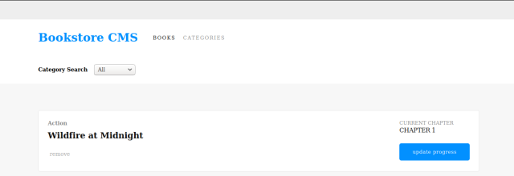
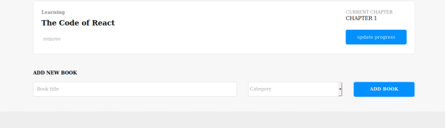

<h1 align="center">Welcome to Bookstore Frontend 👋</h1>

This project is a bookstore app with React & Redux. <br />
The [original page](https://github.com/shjang7/react-bookstore) was built for front-end side only, but this time it built full-stack connecting with [back-end](https://github.com/shjang7/bookstore-backend) side.




## Function description

- Add book
- Delete book
- View books list

## Built With

- React
- Redux
- React Create App
- JavaScript (ES6)
- CSS 3

## Usage

> Clone the repository to your local machine

```sh
$ git clone https://github.com/shjang7/bookstore-frontend.git
```

> change directory into the directory

```sh
$ cd bookstore-frontend
```

> Install dependencies

```sh
$ npm install
```

> Open backend-side web server before running app

```sh
https://rails-bookstore-backend-suh.herokuapp.com
```

> Start - build and run

```sh
$ npm run start
```

> If it doesn't open automatically, open `http://localhost:3000` using your browser.

## Author

👤 **Suhyeon Jang**

- Github: [@shjang7](https://github.com/shjang7)
- Linked in: [@shjang](https://www.linkedin.com/in/shjang/)

## 🤝 Contributing

Contributions, issues and feature requests are welcome!<br />Feel free to check [issues page](https://github.com/shjang7/bookstore-frontend/issues).

1. Fork it (https://github.com/shjang7/bookstore-frontend/fork)
2. Create your working branch (git checkout -b [choose-a-name])
3. Commit your changes (git commit -am 'what this commit will fix/add')
4. Push to the branch (git push origin feature/[feature-name])
5. Create a new Pull Request

## Show your support

Give a ⭐️ if you like this project!

## 📝 License

This project is [MIT](./LICENSE) licensed.
